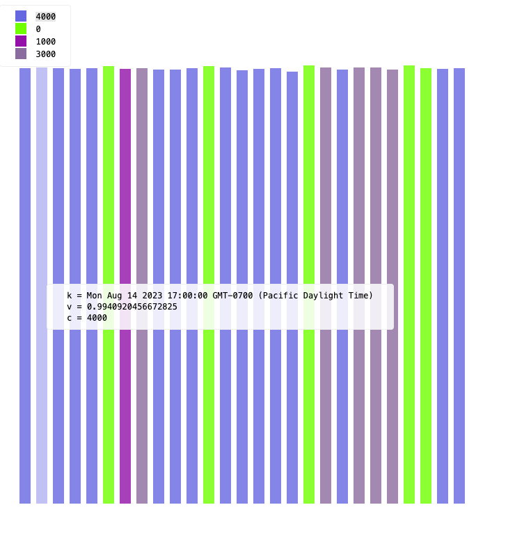

# vzi.el

Pipe data from emacs to the browser.

## Usage

This package is experimental and not fully documented yet, that will take some time.
However, here's a quick example which demonstrates a few features.

Start with an org table, like this one:

```org
#+LET: vzi-row-select (lambda (row i) (when (> i 1) row))
#+LET: vzi-flag-module "bucket"
#+LET: vzi-flag-defines '("v=$[5]/$[4]" "k=0" "c=Math.floor($[7] / 1000) * 1000")
#+LET: vzi-flag-page-local t
| start                    | until                    |                open |               close |                high |                 low | number | volume | weighted |
|--------------------------+--------------------------+---------------------+---------------------+---------------------+---------------------+--------+--------+----------|
| 2023-08-14T00:00:00.000Z | 2023-08-15T00:00:00.000Z |           0.0069036 |          0.00687578 |          0.00690989 |           0.0068625 |      1 |   4590 |   0.0069 |
| 2023-08-15T00:00:00.000Z | 2023-08-16T00:00:00.000Z |           0.0068748 |           0.0068661 |          0.00689071 |             0.00685 |      1 |   4589 |   0.0069 |
| 2023-08-16T00:00:00.000Z | 2023-08-17T00:00:00.000Z |           0.0068663 |           0.0068326 |          0.00688127 |           0.0068293 |      1 |   4589 |   0.0069 |
| 2023-08-17T00:00:00.000Z | 2023-08-18T00:00:00.000Z |          0.00683326 |            0.006861 |           0.0068686 |             0.00681 |      1 |   4588 |   0.0068 |
| 2023-08-18T00:00:00.000Z | 2023-08-19T00:00:00.000Z |           0.0068629 |          0.00687711 |          0.00689879 |             0.00685 |      1 |   4092 |   0.0069 |
| 2023-08-20T00:00:00.000Z | 2023-08-21T00:00:00.000Z |          0.00688231 |          0.00688094 |          0.00688625 |             0.00687 |      1 |    179 |   0.0069 |
| 2023-08-21T00:00:00.000Z | 2023-08-22T00:00:00.000Z |          0.00688103 |          0.00683737 |          0.00688905 |             0.00683 |      1 |   1793 |   0.0069 |
| 2023-08-22T00:00:00.000Z | 2023-08-23T00:00:00.000Z |          0.00683625 |          0.00685895 |          0.00687238 |             0.00682 |      1 |   3643 |   0.0069 |
| 2023-08-23T00:00:00.000Z | 2023-08-24T00:00:00.000Z |            0.006858 |             0.00691 |          0.00691726 |             0.00685 |      1 |   4576 |   0.0069 |
| 2023-08-24T00:00:00.000Z | 2023-08-25T00:00:00.000Z |           0.0069096 |           0.0068451 |          0.00691448 |             0.00684 |      1 |   4571 |   0.0069 |
| 2023-08-25T00:00:00.000Z | 2023-08-26T00:00:00.000Z |          0.00684678 |          0.00682874 |           0.0068594 |             0.00681 |      1 |   4032 |   0.0068 |
| 2023-08-27T00:00:00.000Z | 2023-08-28T00:00:00.000Z |           0.0068144 |          0.00682361 |          0.00682948 |             0.00681 |      1 |    584 |   0.0068 |
| 2023-08-28T00:00:00.000Z | 2023-08-29T00:00:00.000Z |           0.0068225 |           0.0068266 |          0.00683602 |              0.0068 |      1 |   4552 |   0.0068 |
| 2023-08-29T00:00:00.000Z | 2023-08-30T00:00:00.000Z |           0.0068267 |           0.0068492 |          0.00686394 |             0.00678 |      1 |   4552 |   0.0068 |
| 2023-08-30T00:00:00.000Z | 2023-08-31T00:00:00.000Z |          0.00684889 |           0.0068441 |           0.0068695 |             0.00681 |      1 |   4073 |   0.0068 |
| 2023-08-31T00:00:00.000Z | 2023-09-01T00:00:00.000Z |           0.0068443 |          0.00687384 |          0.00687947 |             0.00683 |      1 |   4342 |   0.0069 |
| 2023-09-01T00:00:00.000Z | 2023-09-02T00:00:00.000Z |           0.0068723 | 0.00683952424269368 |           0.0069212 |             0.00682 |      1 |   4065 |   0.0069 |
| 2023-09-03T00:00:00.000Z | 2023-09-04T00:00:00.000Z | 0.00683952424269368 | 0.00683952424269368 | 0.00683952424269368 | 0.00683952424269368 |      1 |      1 |   0.0068 |
| 2023-09-04T00:00:00.000Z | 2023-09-05T00:00:00.000Z | 0.00684500177970046 |            0.006823 | 0.00684523605796546 |             0.00681 |      1 |   3725 |   0.0068 |
| 2023-09-05T00:00:00.000Z | 2023-09-06T00:00:00.000Z | 0.00682374937733287 |           0.0067804 | 0.00682584538095043 |             0.00676 |      1 |   4479 |   0.0068 |
| 2023-09-06T00:00:00.000Z | 2023-09-07T00:00:00.000Z |           0.0067807 |           0.0067687 | 0.00679643323183993 |           0.0067647 |      1 |   3969 |   0.0068 |
| 2023-09-07T00:00:00.000Z | 2023-09-08T00:00:00.000Z | 0.00676956404007582 |           0.0067865 | 0.00680050051683804 |             0.00676 |      1 |   3823 |   0.0068 |
| 2023-09-08T00:00:00.000Z | 2023-09-09T00:00:00.000Z |            0.006787 | 0.00676498444053579 | 0.00681867772201615 |             0.00675 |      1 |   3713 |   0.0068 |
| 2023-09-09T00:00:00.000Z | 2023-09-10T00:00:00.000Z | 0.00676498444053579 | 0.00676498444053579 | 0.00676498444053579 | 0.00676498444053579 |      1 |      1 |   0.0068 |
| 2023-09-10T00:00:00.000Z | 2023-09-11T00:00:00.000Z |           0.0067995 | 0.00679675658775632 | 0.00681719022687609 | 0.00676498444053579 |      1 |    878 |   0.0068 |
| 2023-09-11T00:00:00.000Z | 2023-09-12T00:00:00.000Z |           0.0067957 |           0.0068169 | 0.00685316410586768 |           0.0067957 |      1 |   4543 |   0.0068 |
| 2023-09-12T00:00:00.000Z | 2023-09-13T00:00:00.000Z |            0.006817 |            0.006794 | 0.00682733665597051 |             0.00678 |      1 |   4542 |   0.0068 |
```

If you've installed the key bindings, with your cursor over the table do `C-c v t` (`vzi-send-table`).
Note that the `#LET:` headers are not necessary, but show how you can pass flags and options easily.

[vzi](https://github.com/jflatow/vzi) supports piping arbitrary data though, not just tables.
You can send a raw region using `C-c v r` (`vzi-send-raw`).

You can also render the output report directly in a webkit buffer inside emacs, if you've got those installed.
Actually, you can render *any* html in a webkit buffer using `C-c v w` (`vzi-buffer-to-webkit`).
However the special `\*vzi report\*` buffer is designed to work seemlessly with this command.

Here's a screenshot of the (silly) example above:

.

Please note that [vzi](https://github.com/jflatow/vzi) is also actively experimental.
The existing builtin visualization modules are not perfect and there are some new ones under development.
You are welcome to get involved.

Also note that the default host page is set to use `vzi.sci.sh`, which is extremely experimental and definitely going to change.
However you can always force `vzi` to use the local host page using `#+LET: vzi-flag-page-local t` as in the example above.
If you want to get involved in either project, please feel free to reach out to [me](https://twitter.com/jmflatow).

## Install

Depends on [vzi](https://github.com/jflatow/vzi).

```elisp
(use-package vzi
  :straight (:host github :repo "jflatow/vzi.el")
  :bind-keymap ("C-c v" . vzi-keys))
```

## Testing

Run all tests:

```
make test
```

Or cool debugging tests workflow:

```
make test-debug SELECTOR=extract-table
```

Then use `ert` to debug ('?' for help).
